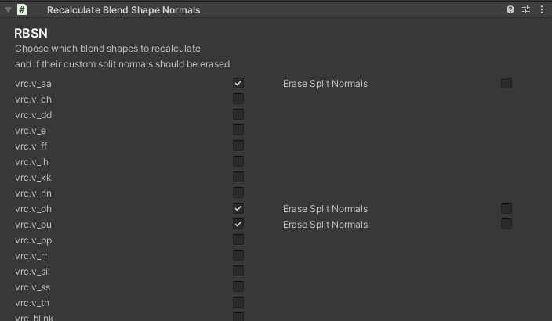

# Recalculate Blendshape Normals
Standalone version of [Hai~vr](https://github.com/hai-vr/)'s blendshape normal recalculator. Meant for avatar artists who want to reduce project dependencies and customer friction. 

### Add to VRChat Creator Companion
https://rykertm.github.io/vpm-listing/

### *Requires VRCFury or MA
This script hooks onto the OnPreprocessAvatar() method called by VRCFury.

### Prepare your FBX first...
Enable 'Legacy Blend Shapes Normals' OR set 'Blend Shape Normals' to 'None.' 

### Add the component
On the GameObject containing the SkinnedMeshRenderer (RykerTM/Recalculate Blend Shape Normals).

Don't forget to save.

### Note:
Checking 'Erase Split Normals' on the blend shape will calculate the normals of that blend shape without using the custom split normals of the mesh. Leave this unchecked if you are unsure whether or not to use it.
